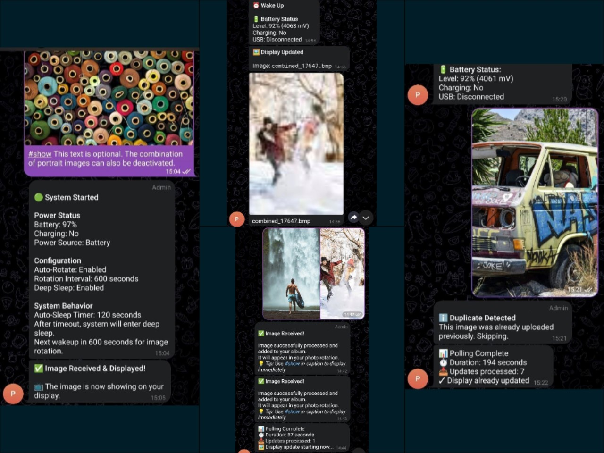

# esp32-photoframe-tlg (ESP32-S3 PhotoFrame Extended v1.9.0)
Extended version of [aitjcize's ESP32-S3 PhotoFrame](https://aitjcize.github.io/esp32-photoframe/) with advanced features for Waveshare's ESP32-S3 PhotoPainter with RESTful API, webapp and comprehensive Telegram integration features.

---





## Feature Status

Legend: :white_check_mark: = Tested and Working | :grey_question: = Untested/In Progress

### Implemented Features

#### Telegram Integration
- :white_check_mark: Telegram bot REST-API commands + `/help`
- :white_check_mark: Wake-up Telegram notifications (battery, preview, pre-sleep)
- :white_check_mark: Optional wake-up telegram command window
- :white_check_mark: Text overlay (caption or message `/txt`)
- :white_check_mark: Fetch image from chat (BMP + thumbnail)
- :white_check_mark: Displayed image preview + filename sent to Telegram
- :white_check_mark: Telegram ACK on download image
- :white_check_mark: Telegram instant show uploaded image as `#show` command
- :white_check_mark: Telegram token/chat ID via Web-UI (NVS)

#### Display & Image Management
- :white_check_mark: History management (show/delete) - requires >10 images on SD card
- :white_check_mark: Optional portrait pairing to landscape BMP (auto combine)
- :white_check_mark: WiFi stopped before display update (saves energy)
- :white_check_mark: Fallback: gradual increase of init timings
- :white_check_mark: Local script for batch and combine portrait mode

#### Power Management
- :grey_question:Battery <20%: text overlay
- :grey_question:Battery <20%: notify Telegram message + auto interval increase

#### System & Configuration
- :white_check_mark: Initial read WiFi credentials file from SD card
- :white_check_mark: Build option to disable logging
- :white_check_mark: Duplicate check without mapping file (file unique ID)
- :white_check_mark: Option to disable serial logging
- :grey_question:WiFi reset via BOOT press (10s) when device active
- :grey_question:Read WiFi credentials file from SD card via BOOT press (2s)

#### Advanced Features
- :grey_question:Random non-repeating image rotation (MD5 up to 1000)
- :grey_question:Buffer download with SD-Card fallback
- :grey_question:URL rotation mode from v1.9.0

---

## Planned Features & ToDo

### Web Interface
- Show and edit settings on webpage
- Batch and combine portrait mode on webpage image upload (if USB connected)
- Set rotation URL via webpage

### Telegram Enhancements
- Set Telegram token and chat ID via text file on SD card
- Allow only one show/display command per wake-up session
- Handle portrait mode on show/display command during wake-up session
- Improved text overlay (layout, style, charset)
- Text overlay management on webpage (add/delete/change)
- Better Telegram image filenames (username + date)
- Trigger next random image via Telegram command
- Analyze behavior of multi (batch) uploads of multiple images in single message

### System Improvements
- Options for HTTP image download
- Split very long rotation intervals
- Duplicate check with mapping file (without file unique ID)
- Optional logging on SD-Card with webpage log viewer
- Disable pre-shared-key ciphersuites when no image upload
- Disable mbedTLS allocation from SPIRAM when no image upload
- Recognize monochrome images to use different conversion algorithm

### Major Feature Additions
- **OTA firmware update** (USB-powered), if possible
- **4 preset modes** (USB/battery, full/eco/custom)
- **RTC wake/alarms**, RTC battery status check
- **Show image on date and time**
- **Optional BLE wake-up**
- **Optional speaker & temp/humidity features**
- **Optional weather kiosk mode** (if USB connected)
- **Streaming decode**, if possible

---

## Credits
Based on [aitjcize's ESP32-S3 PhotoFrame](https://github.com/aitjcize/esp32-photoframe) project.


# ESP32-S3 Photo Frame Extended Firmware Documentation (v1.9.0-tlg)

## Hardware Platform
- **MCU**: ESP32-S3-WROOM-1 N16R8 (Waveshare ESP32-S3-PhotoPainter)
- **Flash**: 16 MB
- **PSRAM**: 8 MB
- **Display**: E-paper 800x480 E6 Spectra (6-color palette)
- **Power Management**: AXP2101 PMIC
- **Storage**: SD Card (FAT32) - microSDXC not working?
- **Battery**: Rechargeable Li-ion with charging via USB-C

## Pin Configuration

| Function | GPIO | Description |
|----------|------|-------------|
| BOOT Button | GPIO 0 | Boot/download mode, web interface wake |
| KEY Button | GPIO 4 | Manual image rotation |
| PWR Button | GPIO 5 | AXP2101 SYSOUT pin (not user-configurable) |
| LED Red | GPIO 45 | Battery mode indicator (active-low) |
| LED Green | GPIO 42 | Sleep countdown indicator (active-low) |
| SD Card CLK | GPIO 39 | SDMMC clock |
| SD Card CMD | GPIO 41 | SDMMC command |
| SD Card D0-D3 | GPIO 40, 1, 2, 38 | SDMMC 4-bit data |

## System Overview

This firmware implements a photo frame with the following key features:

- **Auto-rotate images** from SD card with configurable intervals
- **Telegram bot integration** for remote control and image uploads
- **Battery management** with low-power modes and notifications
- **WiFi provisioning** via SD card, NVS, or captive portal
- **RESTful API** for automation and integration (Home Assistant compatible)
- **Modern web interface** with drag-and-drop image upload
- **Deep sleep** optimization for battery operation
- **Portrait image combining** for dual-image displays
- **Enhanced image processing** with measured palette dithering
- **Multiple wake sources** (timer, buttons)

## System Architecture

### Core Components

| Component | File | Purpose |
|-----------|------|---------|
| Main Application | `main.c` | System initialization, boot flow control |
| Power Manager | `power_manager.c` | Deep sleep, wake-up handling, LED control |
| Telegram Bot | `telegram_bot.c` | Bot API, image processing, command handling |
| Battery Manager | `battery_manager.c` | Battery monitoring, warnings, state tracking |
| WiFi Manager | `wifi_manager.c` | WiFi connection, credential management |
| WiFi Provisioning | `wifi_provisioning.c` | Captive portal AP mode |
| Config Manager | `config_manager.c` | NVS settings storage and retrieval |
| Display Manager | `display_manager.h` | E-paper display control, image rendering |
| Image Processor | `image_processor.c` | JPEG decoding, BMP conversion, resizing |
| Album Manager | `album_manager.c` | Image library management |
| HTTP Server | `http_server.h` | REST API and web interface |
| API Handlers | `api_handlers.c/h` | REST API endpoint implementations |
| Color Palette | `color_palette.c` | 6-color measured palette for dithering |
| DNS Server | `dns_server.c` | Captive portal DNS redirect |

### Memory Architecture

The system uses both internal SRAM and external PSRAM:

```
Component                Capacity    System Overhead    Available
─────────────────────────────────────────────────────────────────
PSRAM Total              8 MB        500 KB             7.5 MB
E-paper buffer           120 KB      permanent          -
WiFi/stack/tasks         200 KB      runtime            -
Available for images     -           -                  7.2 MB
─────────────────────────────────────────────────────────────────
Download Buffer          2 MB        PSRAM              temporary
Decode Buffer            4 MB        PSRAM              temporary
Resize Buffer            1.15 MB     800×480×3          temporary
```

### Task Stack Sizes

| Task | Stack Size | Purpose |
|------|------------|---------|
| `telegram_check_task` | 32 KB | Telegram polling and command processing |
| `send_photo_task` | 40 KB | Telegram photo upload (SPIRAM-allocated) |
| `sleep_timer_task` | 4 KB | Auto-sleep countdown monitoring |
| `rotation_timer_task` | 16 KB | Active rotation when awake |
| `button_task` | 12 KB | Button press monitoring |

## Quick Start

### First Boot - WiFi Setup

The device supports three methods for WiFi configuration (in priority order):

1. **NVS (Previously Saved)** (use `idf.py erase-flash` to delete)
2. **SD Card File** (`/sdcard/wifi.txt`)
   ```
   YourSSID
   YourPassword
   ```
3. **Captive Portal** (AP Mode)
   - Connect to **PhotoFrame-Setup** (open network)
   - Navigate to `http://192.168.4.1`
   - Enter WiFi credentials

### Web Interface Access

Once connected to WiFi, access the device at:
- **mDNS**: `http://photoframe.local`
- **IP Address**: Check serial console, request by Telegram command or use network scanner

> **Note**
> `esp_log_level_set("*", ESP_LOG_DEBUG);` logging on serial console is disabled in main()

### Telegram Bot Setup

1. Create bot via [@BotFather](https://t.me/BotFather)
2. Copy bot token
3. Send `/start` to your bot or use ```https://api.telegram.org/bot<BOT_TOKEN>/getUpdates``` to get Chat ID
4. Configure via web interface or API:
   ```bash
    curl -X POST http://photoframe.local/api/telegram/config \
      -H "Content-Type: application/json" \
      -d '{"token":"BOT_TOKEN"}'
    
    curl -X POST http://photoframe.local/api/telegram/chatid \
      -H "Content-Type: application/json" \
      -d '{"chatid":"CHAT_ID"}'
   ```

## System Workflows

### Boot Flow Decision Tree

```
Power On / Wake Up
    ├─ Check Reset Reason
    │   ├─ POWER_ON → Normal Operation
    │   ├─ DEEP_SLEEP → Check Wake Source
    │   ├─ SOFTWARE / PANIC → Normal Operation
    │   └─ Other → Normal Operation
    │
    ├─ Initialize Hardware
    │   ├─ I2C Bus (for AXP2101)
    │   ├─ AXP2101 Power IC
    │   ├─ NVS Flash
    │   ├─ SD Card (retry 3x)
    │   ├─ Configuration Manager
    │   ├─ Display Manager
    │   ├─ Power Manager
    │   └─ Album Manager
    │
    └─ Branch by Wake Source
        ├─ TIMER_WAKEUP → Auto-Rotate Flow
        ├─ EXT1_WAKEUP (KEY) → Manual Rotation Flow
        ├─ EXT1_WAKEUP (BOOT) → Web Interface Mode
        └─ UNDEFINED → Normal Operation Flow
```

### 1. Timer Wakeup Flow (Auto-Rotate)

**Trigger**: Deep sleep timer expires (rotation interval reached)

**Wake Source**: `ESP_SLEEP_WAKEUP_TIMER`

#### Flow Chart

```
Timer Wake
    ├─ Check Rotation Mode
    │   ├─ URL Mode
    │   │   ├─ Initialize WiFi (60s timeout)
    │   │   ├─ Download image from configured URL
    │   │   ├─ Display image
    │   │   ├─ Stop WiFi
    │   │   └─ Enter Deep Sleep
    │   │
    │   └─ SD Card Mode
    │       ├─ Initialize Telegram Bot
    │       ├─ Check if Telegram enabled
    │       │   ├─ check_telegram_on_timer_wakeup == true?
    │       │   └─ Has Telegram token?
    │       │
    │       ├─ If Telegram Enabled:
    │       │   ├─ Initialize WiFi (30s timeout)
    │       │   ├─ Check for Telegram updates
    │       │   │
    │       │   ├─ If Updates Found:
    │       │   │   ├─ Send battery warning (if < 20% and notify_on_timer_wakeup)
    │       │   │   ├─ Set pendingdisplayupdate = true
    │       │   │   ├─ Start Telegram Polling Task (60s timeout)
    │       │   │   │   ├─ Process commands
    │       │   │   │   ├─ Download photos
    │       │   │   │   ├─ Update display if commanded
    │       │   │   │   └─ Set displaywasupdatedbytelegram flag
    │       │   │   ├─ Send polling complete notification
    │       │   │   ├─ If NOT displaywasupdatedbytelegram:
    │       │   │   │   └─ Execute postponed display update
    │       │   │   └─ Wait for Telegram photo upload (10s max)
    │       │   │
    │       │   └─ If No Updates:
    │       │       ├─ Send wake-up notification (if notify_on_timer_wakeup)
    │       │       ├─ If notify_on_display_update:
    │       │       │   ├─ Get next image path (without displaying)
    │       │       │   ├─ Send notification with thumbnail
    │       │       │   └─ Wait for upload complete
    │       │       ├─ Stop WiFi
    │       │       └─ Display next image
    │       │
    │       └─ If Telegram Disabled:
    │           └─ Display next image from SD card
    │
    └─ Enter Deep Sleep
```

#### Key Flags

| Flag | Purpose | Set When |
|------|---------|----------|
| `check_telegram_on_timer_wakeup` | Enable Telegram checks on auto-rotate | User configures via bot/~~web~~ |
| `notify_on_timer_wakeup` | Send battery status notification | User configures via bot/~~web~~ |
| `notify_on_display_update` | Send image thumbnail before display | User configures via bot/~~web~~ |
| `notify_on_sleep` | Send notification before entering sleep | User configures via bot/~~web~~ |
| `displaywasupdatedbytelegram` | Skip postponed update if already shown | Telegram command displays image |
| `pendingdisplayupdate` | Postpone display until after polling | Telegram updates found |

#### Battery State Handling

During timer wake, the system checks battery level:

- **Battery < 20% AND not charging AND battery present**:
  - Send Telegram warning (if `notify_on_timer_wakeup` enabled)
  - Activate Battery Low Mode (rotation interval → 6 hours, if it was less than 6 hours before)

- **Battery ≥ 80% OR charging OR USB connected**:
  - Deactivate Battery Low Mode
  - Restore saved rotation interval

### 2. Button Wakeup Flows

#### KEY Button Wake (Manual Rotation)

**Trigger**: User presses KEY button

**Wake Source**: `ESP_SLEEP_WAKEUP_EXT1` (KEY_BUTTON GPIO 4)

```
KEY Button Wake
    ├─ Simple rotation mode (no WiFi, no Telegram)
    ├─ Display next image from SD card
    └─ Enter Deep Sleep immediately
```

**Characteristics**:
- Fastest wake-to-sleep cycle (~40s total)
- Minimal power consumption
- No network operations
- Direct SD card image rotation

#### BOOT Button Wake (Web Interface Mode)

**Trigger**: User presses BOOT button

**Wake Source**: `ESP_SLEEP_WAKEUP_EXT1` (BOOT_BUTTON GPIO 0)

```
BOOT Button Wake
    ├─ Initialize WiFi (see WiFi Init Flow)
    ├─ If Telegram configured:
    │   ├─ Send BOOT wake notification
    │   └─ Start Telegram polling task
    ├─ Start HTTP server (web interface)
    ├─ Start button monitor task
    │   ├─ BOOT 2s hold → Reload WiFi from SD card
    │   ├─ BOOT 10s hold → Reset WiFi credentials
    │   └─ KEY press → Manual rotation
    ├─ System stays awake
    │   ├─ Auto-sleep timer active (120s default)
    │   ├─ Button press resets timer
    │   └─ Active rotation if USB connected
    └─ Enter Deep Sleep on timeout
```

**Button Actions While Awake**:

| Button | Duration | Action |
|--------|----------|--------|
| BOOT | Short press | Reset auto-sleep timer |
| BOOT | 2s hold | Load WiFi from SD card → Connect → Save to NVS |
| BOOT | 10s hold | Erase WiFi credentials → Restart (provisioning mode) |
| KEY | Short press | Trigger manual image rotation |

### 3. Power-On Boot (Normal Operation)

**Trigger**: Power connected, reset button, or power cycle

**Wake Source**: `ESP_RST_POWERON` or other non-sleep resets

```
Power-On Boot
    ├─ Full hardware initialization
    ├─ WiFi Initialization (see WiFi Init Flow)
    ├─ HTTP server start
    ├─ Telegram bot initialization
    ├─ If Telegram configured AND not USB:
    │   └─ Send Power-On notification
    │       ├─ Battery status
    │       ├─ Configuration summary
    │       └─ System behavior info
    ├─ Start button monitor task
    ├─ System runs continuously
    │   ├─ If USB connected:
    │   │   ├─ Stay awake indefinitely
    │   │   └─ Active rotation (if enabled)
    │   └─ If on battery:
    │       ├─ Auto-sleep timer (120s)
    │       └─ Enter deep sleep on timeout
    └─ Web interface available at http://photoframe.local or IP
```

### 4. WiFi Initialization Flow

WiFi credentials are loaded with the following priority:

```
WiFi Init
    ├─ Priority 1: NVS (Non-Volatile Storage)
    │   ├─ Try load saved credentials
    │   ├─ If found → Connect
    │   └─ If success → Done
    │
    ├─ Priority 2: SD Card
    │   ├─ Check /sdcard/wifi.txt
    │   │   Format:
    │   │   Line 1: SSID
    │   │   Line 2: Password
    │   ├─ If found → Load credentials
    │   ├─ Try connect (30s timeout)
    │   ├─ If success:
    │   │   ├─ Save to NVS
    │   │   ├─ Rename wifi.txt → wifi.bak
    │   │   └─ Start mDNS service
    │   └─ If fail → Continue to Priority 3
    │
    └─ Priority 3: Provisioning AP
        ├─ Start WiFi Access Point
        │   SSID: PhotoFrame-Setup
        │   Security: Open (no password)
        │   IP: 192.168.4.1
        ├─ Start DNS server (captive portal detection)
        │   ├─ iOS: /hotspot-detect.html
        │   ├─ Android: /generate_204
        │   └─ Windows: /connecttest.txt
        ├─ User connects to AP
        ├─ User opens http://192.168.4.1 (or gets redirected)
        ├─ User enters WiFi credentials
        ├─ System tests connection
        ├─ If successful:
        │   ├─ Save credentials to NVS
        │   └─ Restart device
        └─ If failed: Show error and retry
```

**WiFi Stop Modes**:

| Mode | Usage | Behavior |
|------|-------|----------|
| Normal Stop | Web interface mode | Keep WiFi active for user access |
| Suppress Reconnect | Telegram timer check | Stop WiFi, prevent auto-reconnect |
| Disconnect Only | Temporary | Disconnect but allow reconnect |

### 5. Telegram Polling Flow

When Telegram updates are detected during timer wake:

```
Telegram Polling
    ├─ Initial check finds updates
    ├─ Send battery warning (if notify_on_timer_wakeup AND battery < 20%)
    ├─ Enter 60-second polling mode
    │   ├─ Poll interval: configurable (default 10s)
    │   ├─ Reset timeout on each update
    │   └─ Exit on 60s no-update timeout
    │
    ├─ Process Updates:
    │   ├─ Photo Messages
    │   │   ├─ Download JPEG (max 2 MB)
    │   │   ├─ Check for duplicate (file_unique_id)
    │   │   ├─ Detect portrait/landscape
    │   │   ├─ If portrait:
    │   │   │   ├─ Save to portrait/ subdirectory
    │   │   │   ├─ Check for pair
    │   │   │   └─ Combine if pair found
    │   │   ├─ Convert to BMP for e-paper
    │   │   ├─ Save thumbnail (.jpg)
    │   │   ├─ Save caption as overlay text (optional)
    │   │   ├─ Check for display triggers ("show", "display", "now")
    │   │   └─ If trigger → Display immediately + set flag
    │   │
    │   ├─ Document Messages (as photo)
    │   │   ├─ Validate MIME type (image/jpeg)
    │   │   ├─ Process same as photo
    │   │   └─ Check display triggers
    │   │
    │   └─ Text Commands (see Telegram Commands section)
    │
    ├─ Send polling complete notification
    │   ├─ Duration
    │   ├─ Update count
    │   └─ Display status
    │
    ├─ If pendingdisplayupdate AND NOT displaywasupdatedbytelegram:
    │   └─ Execute postponed display update
    │
    └─ Wait for Telegram photo notification complete (10s max)
```

#### Telegram Commands

| Command | Description | Example |
|---------|-------------|---------|
| `/help`, `/start` | Show command list | `/help` |
| `/status` | System status, IPs, memory | `/status` |
| `/battery` | Battery details | `/battery` |
| `/config` | Current configuration | `/config` |
| `/albums` | List albums | `/albums` |
| `/images <album>` | List images in album | `/images Vacation` |
| `/create_album <name>` | Create new album | |
| `/delete_album <name>` | Delete album | |
| `/enable_album <name>` | Enable album| |
| `/disable_album <name>` | Disable album | |
| `/display <album/image>` | Show specific image | `/display Default/photo.bmp` |
| `/txt <text>` | Show text overlay on next image | `/txt Hello World` |
| `/history` | View displayed images count | `/history` |
| `/clear_history` | Reset display history | `/clear_history` |
| `/combine on\|off` | Enable/disable portrait combine | `/combine on` |
| `/config` | Show current config | |
| `/set_interval <seconds>` | Set rotation interval | `/set_interval 3600` |
| `/autorotate on\|off` | Enable/disable auto-rotation | `/autorotate on` |
| `/brightness <-2.0 to 2.0>` | Adjust brightness | `/brightness 0.5` |
| `/contrast <0.5 to 2.0>` | Adjust contrast | `/contrast 1.3` |
| `/telegram_settings` | Show Telegram settings | |
| `/telegram_check_timer on\|off` | Enable timer check | `/telegram_check_timer on` |
| `/telegram_notify_timer on\|off` | Enable timer notification | `/telegram_notify_timer on` |
| `/telegram_notify_sleep on\|off` | Enable sleep notification | `/telegram_notify_sleep off` |
| `/telegram_notify_display on\|off` | Enable display notification | `/telegram_notify_display on` |
| `/my_chat_id` | Show chat ID | `/my_chat_id` |
| `/sleep` | Enter deep sleep | `/sleep` |

Send photos or files (JPEG) Add caption <code>#show</code> to display immediately 


#### Duplicate Detection

The system automatically detects duplicate images using `file_unique_id`:

1. Telegram provides `file_unique_id` for each photo/document
2. System generates filename: `tg_<sanitized_unique_id>.bmp`
3. Before processing, check if file exists
4. If duplicate found:
   - Send "Duplicate Detected" message
   - Skip processing
   - Return `ESP_ERR_INVALID_STATE`

### 6. Battery Management

The system continuously monitors battery state and adjusts behavior:

```
Battery States & Thresholds
    ├─ CRITICAL (< 10%)
    │   ├─ Send critical warning via Telegram
    │   ├─ Play audio warning (not implemented)
    │   └─ System may shut down soon
    │
    ├─ LOW (10-20%)
    │   ├─ Send low battery warning via Telegram
    │   ├─ Play audio warning (not implemented)
    │   └─ Activate Battery Low Mode:
    │       ├─ Save current rotation interval
    │       ├─ Set interval to 21600s (6 hours)
    │       ├─ Store state in NVS
    │       └─ Reduce wake frequency
    │
    └─ NORMAL (≥ 20% or ≥ 80% recovery)
        ├─ If recovering from LOW/CRITICAL:
        │   ├─ Play recovery sound (not implemented)
        │   └─ Send recovery notification
        └─ Deactivate Battery Low Mode:
            ├─ Restore saved rotation interval
            ├─ Clear NVS flags
            └─ Resume normal operation
```

**Battery Low Mode Trigger**:
- Battery < 20% **AND**
- Not charging **AND**
- Battery present (not USB-only mode)

**Battery Low Mode Exit**:
- Battery ≥ 80% **OR**
- Charging active **OR**
- USB connected **OR**
- No battery detected

**LED Indicators**:
- **Red LED ON**: Deep sleep enabled (battery mode)
- **Red LED OFF**: Deep sleep disabled or USB powered
- **Green LED Blinking** (10s interval): Auto-sleep countdown active

### 7. Sleep Management

The system uses deep sleep for power efficiency on battery:

```
Sleep Decision Tree
    ├─ USB Connected?
    │   ├─ Yes → Stay Awake
    │   │   ├─ No auto-sleep
    │   │   ├─ Active rotation (if enabled)
    │   │   └─ Web interface available
    │   │
    │   └─ No (On Battery)
    │       ├─ Deep Sleep Enabled?
    │       │   ├─ Yes → Auto-Sleep Mode
    │       │   │   ├─ Start 120s countdown
    │       │   │   ├─ Button press resets timer
    │       │   │   ├─ Green LED blinks (10s interval)
    │       │   │   └─ Enter deep sleep on timeout
    │       │   │
    │       │   └─ No → Active Mode
    │       │       ├─ No auto-sleep
    │       │       ├─ Active rotation (if enabled)
    │       │       └─ Battery drains faster
    │       │
    │       └─ Battery Low Mode?
    │           └─ Yes → Extended sleep intervals (6 hours)
```

#### Enter Deep Sleep Sequence

```
Prepare Sleep
    ├─ Disable automatic light sleep
    ├─ Turn off LEDs (save power)
    ├─ If notify_on_sleep enabled:
    │   └─ Send Telegram notification
    │       ├─ Configuration summary
    │       ├─ Battery status
    │       └─ Next wakeup time
    ├─ If auto-rotate enabled:
    │   └─ Enable timer wakeup (rotation interval)
    ├─ Enable button wakeup (BOOT + KEY) <- not implemented
    │   └─ ESP_EXT1_WAKEUP_ANY_LOW
    ├─ Hold GPIO state (prevent floating)
    ├─ Configure AXP2101 for sleep
    └─ Execute esp_deep_sleep_start()
```

### 8. Power State Diagram

```
┌─────────────────┐
│   Deep Sleep    │ ← System Reset / Power Off
│                 │
│  • CPU Off      │
│  • Display Off  │
│  • WiFi Off     │
│  • < 1 mA ?     │
└────────┬────────┘
         │
         │ Timer Wake / Button Press
         ▼
┌─────────────────┐
│  System Boot    │
│                 │
│  • Hardware     │
│  • Wake Check   │
└────────┬────────┘
         │
         ├─ Timer Wake ──────────────┐
         │                           │
         ├─ KEY Button ──────────┐   │
         │                       │   │
         └─ BOOT / Power-On ─┐   │   │
                             │   │   │
         ┌───────────────────┘   │   │
         │                       │   │
         ▼                       ▼   ▼
┌─────────────────┐    ┌─────────────────┐
│     Normal      │    │   Quick Flows   │
│   Operation     │    │                 │
│                 │    │  • Timer Rotate │
│  • Web Server   │    │  • Key Rotate   │
│  • Telegram     │    └────────┬────────┘
│  • Button Task  │             │
│  • Auto-Sleep   │             │
└────────┬────────┘             │
         │                      │
         │ Timeout / Command    │
         │                      │
         └──────────┬───────────┘
                    │
                    ▼
         ┌─────────────────┐
         │  Enter Sleep    │
         │                 │
         │  • Send Notif   │
         │  • Set Wakeup   │
         │  • Power Down   │
         └────────┬────────┘
                  │
                  │
                  ▼
         ┌─────────────────┐
         │   Deep Sleep    │
         └─────────────────┘
```

## REST API

The firmware provides a comprehensive RESTful API for automation and integration. All endpoints are accessible at `http://<device-ip>/api/`.

See [API.md](API.md) for complete documentation.

### Quick Reference

| Endpoint | Method | Purpose |
|----------|--------|---------|
| `/api/albums` | GET | List all albums |
| `/api/albums` | POST | Create album |
| `/api/albums?name=<name>` | DELETE | Delete album |
| `/api/albums/enabled?name=<name>` | PUT | Enable/disable album |
| `/api/images?album=<name>` | GET | List images in album |
| `/api/image?name=<path>` | GET | Get image thumbnail |
| `/api/upload` | POST | Upload image (multipart) |
| `/api/display` | POST | Display specific image |
| `/api/display-image` | POST | Upload & display JPEG |
| `/api/delete` | POST | Delete image |
| `/api/config` | GET | Get configuration |
| `/api/config` | POST | Update configuration |
| `/api/battery` | GET | Get battery status |
| `/api/sleep` | POST | Enter deep sleep |

### Home Assistant Integration Example

```yaml
# REST Sensor
sensor:
  - platform: rest
    name: "PhotoFrame Battery"
    resource: "http://photoframe.local/api/battery"
    value_template: "{{ value_json.battery_percent }}"
    unit_of_measurement: "%"
    json_attributes:
      - battery_voltage_mv
      - charging
      - usb_connected
    scan_interval: 300

# REST Command
rest_command:
  photoframe_sleep:
    url: "http://photoframe.local/api/sleep"
    method: POST

  photoframe_display:
    url: "http://photoframe.local/api/display-image"
    method: POST
    content_type: "image/jpeg"
    payload: "{{ image_data }}"

# Automation
automation:
  - alias: "PhotoFrame sleep at night"
    trigger:
      - platform: time
        at: "23:00:00"
    action:
      - service: rest_command.photoframe_sleep
```

## Configuration Flags

### Telegram Settings (NVS Stored)

| Setting | NVS Key | Default | Description |
|---------|---------|---------|-------------|
| `check_telegram_on_timer_wakeup` | `tg_check_timer` | `true` | Check for Telegram updates on auto-rotate wake |
| `notify_on_timer_wakeup` | `tg_notify_timer` | `true` | Send battery status notification on timer wake |
| `notify_on_sleep` | `tg_notify_sleep` | `false` | Send notification before entering deep sleep |
| `notify_on_display_update` | `tg_notify_display` | `true` | Send image thumbnail when display updates |
| Telegram Token | `tg_token` | - | Bot API token |
| Telegram Chat ID | `tg_chat_id` | - | User chat ID |

**Configuration Methods**:
- Telegram commands: `/telegram_check_timer on|off`, etc.
- Web interface: Settings page
- REST API: POST `/api/config`

### System Configuration (NVS Stored)

| Setting | Key | Default | Range | Description |
|---------|-----|---------|-------|-------------|
| Rotation Interval | `rotate_int` | 3600s | 10-86400s | Time between auto-rotates |
| Auto-Rotate | `auto_rotate` | `true` | bool | Enable automatic rotation |
| Deep Sleep | `deep_sleep` | `true` | bool | Enable deep sleep on battery |
| Brightness | `brightness` | 0.3 | -2.0 to 2.0 | Display brightness (f-stops) |
| Contrast | `contrast` | 1.3 | 0.5 to 2.0 | Display contrast multiplier |
| Portrait Combine | (in code) | `true` | bool | Combine portrait image pairs |
| Rotation Mode | `rotation_mode` | SD Card | 0=URL, 1=SD | Image source mode |
| Image URL | `image_url` | - | string | URL for URL mode |
| Save Downloaded | `save_dl` | - | bool | Save URL images to SD |

### Compile-Time Configuration (`config.h`)

```c
// Battery thresholds
#define BATTERY_CRITICAL_THRESHOLD  10    // Percentage
#define BATTERY_LOW_THRESHOLD       20    // Percentage
#define BATTERY_RECOVER_THRESHOLD   80    // Percentage
#define BATTERY_LOW_MODE_INTERVAL_SEC 21600  // 6 hours

// Timeouts
#define AUTO_SLEEP_TIMEOUT_SEC      120   // Auto-sleep (2 minutes)
#define IMAGE_ROTATE_INTERVAL_SEC   3600  // Default rotation (1 hour)

// Display
#define DISPLAY_WIDTH               800   // E-paper width
#define DISPLAY_HEIGHT              480   // E-paper height

// Telegram
#define TELEGRAM_POLL_INTERVAL_MS   10000 // 10 seconds
#define TELEGRAM_MAX_DOWN_JPG_SIZE  2048  // 2 MB max download

// WiFi
#define ENABLE_WIFI_BOOT_BUTTON_RELOAD 0  // Disable by default
```

## Image Processing

### Client-Side (Web Interface)

1. **Orientation Detection**: Portrait vs. landscape
2. **Cover Mode Scaling**: Fill display exactly
   - Landscape: 800×480 pixels
   - Portrait: 480×800 pixels
3. **JPEG Compression**: 
   - Full-size: 90% quality
   - Thumbnail: 85% quality (200×120 or 120×200)
4. **Upload**: Multipart form data

### Server-Side (ESP32)

1. **JPEG Decoding**: Hardware-accelerated `esp_jpeg`
2. **Portrait Rotation**: Rotate 90° clockwise for display
3. **Contrast Adjustment**: Configurable (default 1.3x, pivot 128)
4. **Brightness Adjustment**: Configurable f-stop (default +0.3)
5. **Measured Palette Dithering**: Floyd-Steinberg to 6 colors
6. **BMP Output**: 800×480 for e-paper display E6 Spectra
7. **Thumbnail Storage**: Keep JPEG for web gallery

### Enhanced vs. Stock Processing

| Feature | Enhanced | Stock |
|---------|----------|-------|
| Color Palette | Measured from device | Theoretical RGB |
| Tone Mapping | S-curve adjustment | Linear |
| Dithering | Floyd-Steinberg | Basic ordered |
| Contrast | Configurable | Fixed |
| Brightness | Configurable | Fixed |
| Quality | Superior on e-paper | Washed out |

## Error Handling

### WiFi Connection Timeouts

The system uses different timeouts based on context:

| Context | Timeout | Behavior on Failure |
|---------|---------|---------------------|
| Timer Wake (URL mode) | 60s | Fallback to SD card rotation |
| Timer Wake (Telegram) | 30s | Skip Telegram, display from SD |
| BOOT Wake | 30s | Keep trying or start AP |
| SD Card Fallback | None | Fall through to provisioning AP |

### Telegram API Errors

| Error | Handling |
|-------|----------|
| No token configured | Skip Telegram operations silently |
| Connection timeout | Log error, continue without Telegram |
| Invalid response | Parse error logged, continue |
| Photo download failed | Try smaller sizes (progressive fallback) |
| Duplicate image | Send notification, skip processing |

### Battery Edge Cases

| Scenario | Behavior |
|----------|----------|
| Battery = -1 (no battery) | Treat as USB mode, no warnings |
| Battery = 0% | Treat as no battery if USB connected |
| Charging transitions | Wait for stable state before mode change |
| USB connected during low mode | Immediately exit battery low mode |

## Performance Optimizations

### Memory Management

1. **JPEG Download**: Uses PSRAM (2 MB buffer)
2. **JPEG Decode**: Uses PSRAM (4 MB buffer)
3. **BMP Processing**: Uses PSRAM for resize operations
4. **Image Caching**: Thumbnails saved as .jpg on SD card
5. **Critical Section**: Free buffers immediately after use
6. **Task Stacks**: SPIRAM-allocated for photo upload task

### Power Optimizations

1. **Automatic Light Sleep**: CPU frequency scales 40-160 MHz when idle
2. **Deep Sleep**: Full system shutdown, < 1 mA current ?
3. **Battery Low Mode**: 6-hour interval when battery < 20%
4. **WiFi On-Demand**: Stop WiFi immediately after Telegram check
5. **LED Management**: Turn off during sleep, active-low control
6. **Display Updates**: ~30-40 seconds, then sleep

### SD Card Optimizations

1. **4-bit SDMMC**: High-speed SD card mode (up to 40 MHz)
2. **Retry Logic**: 3 attempts with 500ms delays
3. **Directory Structure**: Organized albums with portrait subdirectories
4. **Duplicate Check**: Filename-based duplicate detection
5. **Thumbnail Strategy**: JPEG thumbnails for gallery, BMP for display

## Troubleshooting Guide

### System Won't Wake from Deep Sleep

**Check**:
1. Auto-rotate enabled? (`/config` via Telegram before sleep)
2. Rotation interval set? (default 3600s)
3. Battery completely dead? (< 3.0V may prevent wake)
4. Buttons held during sleep entry? (can prevent proper sleep)

**Solution**: Connect USB to force wake and reconfigure.

### WiFi Won't Connect

**Check**:
1. Credentials in NVS: Use web interface or Telegram
2. Credentials on SD card: `/sdcard/wifi.txt` format correct
3. Network available: SSID visible, correct password
4. Provisioning mode: Hold BOOT 10s to reset credentials

**Provisioning Steps**:
1. Hold BOOT button for 10 seconds
2. System restarts in AP mode
3. Connect to "PhotoFrame-Setup" (open network)
4. Open http://192.168.4.1 (or get redirected via captive portal)
5. Enter WiFi credentials
6. System tests connection and saves

### Telegram Not Working

**Check**:
1. Token configured: `/my_chat_id` to verify
2. Chat ID set: Use web interface or send `/start`
3. `check_telegram_on_timer_wakeup` enabled
4. WiFi connecting successfully
5. Bot token valid: Test with BotFather

**Debug**: Check serial console for:
- "No bot token configured"
- "WiFi connection timeout"
- "HTTP request failed"

> **Note**
> `esp_log_level_set("*", ESP_LOG_DEBUG);` logging on serial console is disabled in main()

### Battery Draining Too Fast

**Check**:
1. Deep sleep enabled: `/config` should show "Deep Sleep: enabled"
2. USB not connected: USB prevents sleep
3. Rotation interval: Shorter = more wakes
4. Telegram checks: Disable if not needed
5. Battery low mode: Should activate at 20%

**Power Consumption**:
- Deep sleep: < 1 mA
- Active (no WiFi): ~80 mA
- Active (WiFi on): ~150-200 mA
- Display update: ~200 mA peak (30-40s)
- **Estimated Battery Life** (2000mAh):
  - Sleep only: ~2000 hours (~83 days)
  - 1-hour rotation: ~40 hours (~1.7 days)
  - USB connected: Unlimited

### Images Not Displaying

**Check**:
1. SD card mounted: Check serial console on boot
2. Image format: JPEG or BMP only
3. Image size: < 2 MB for JPEG
4. Album enabled: `/albums` to check status
5. Display history full: Use `/clear_history`

> **Note**
> `esp_log_level_set("*", ESP_LOG_DEBUG);` logging on serial console is disabled in main()

**Supported Formats**:
- **Upload**: JPEG only (max 2 MB, non-progressive preferred)
- **Storage**: BMP 800×480 RGB565
- **Thumbnail**: JPEG (original download)

### Web Interface Not Accessible

**Check**:
1. WiFi connected: Check serial console
2. mDNS working: Try IP address instead of `photoframe.local`
3. Firewall: Allow mDNS (port 5353) and HTTP (port 80)
4. Same network: Device and computer on same WiFi

> **Note**
> `esp_log_level_set("*", ESP_LOG_DEBUG);` logging on serial console is disabled in main()

**Find IP Address**:
- Serial console: Boot logs show IP
- Router admin panel: Look for "photoframe" hostname
- Network scanner: Look for ESP32 device

> **Note**
> `esp_log_level_set("*", ESP_LOG_DEBUG);` logging on serial console is disabled in main()

## Development

### Building from Source

See [DEV.md](DEV.md) for complete build instructions.

**Quick Start**:
```bash
# Set up ESP-IDF environment
. $IDF_PATH/export.sh

# Configure project
cd esp32-photoframe
idf.py set-target esp32s3

# Build and flash
idf.py build
idf.py -p PORT flash monitor
```

### Project Structure

```
esp32-photoframe/
├── main/
│   ├── main.c                 # Entry point, boot flow
│   ├── main.h
│   ├── config.h               # Compile-time configuration
│   ├── power_manager.c/h      # Sleep/wake management
│   ├── telegram_bot.c/h       # Telegram integration
│   ├── battery_manager.c/h    # Battery monitoring
│   ├── wifi_manager.c/h       # WiFi connection
│   ├── wifi_provisioning.c    # Captive portal AP
│   ├── config_manager.c/h     # NVS configuration
│   ├── http_server.h          # Web server
│   ├── api_handlers.c/h       # REST API endpoints
│   ├── album_manager.c        # Album management
│   ├── color_palette.c        # 7-color measured palette
│   ├── dns_server.c           # Captive portal DNS
│   ├── utils.c                # Utility functions
│   ├── display_manager.h      # Display control
│   └── webapp/
│       └── index.html         # Web interface
├── components/
│   └── epaper_src/            # E-paper driver
├── docs/
│   ├── README.md              # This file
│   ├── API.md                 # REST API documentation
│   ├── DEV.md                 # Developer guide
│   └── MEASURED_PALETTE.md    # Color palette details
└── workflow_diagrams/
    ├── 01_main_flow.puml
    ├── 02_timer_wakeup.puml
    ├── 03_button_wakeup.puml
    ├── 04_wifi_initialization.puml
    ├── 05_telegram_polling.puml
    ├── 06_battery_management.puml
    ├── 07_sleep_management.puml
    ├── 08_enter_sleep.puml
    └── 09_power_states.puml
```

### Adding New Telegram Commands

1. Add command handler in `telegram_bot.c` → `handle_telegram_command()`
2. Parse command text and parameters
3. Call appropriate API function
4. Send response via `telegrambot_send_message()`
5. Update `/help` command text

### Modifying Wake Behavior

1. Edit `power_manager.c` → `powermanager_enter_sleep()`
2. Configure wake sources:
   - Timer: `esp_sleep_enable_timer_wakeup()`
   - Buttons: `esp_sleep_enable_ext1_wakeup()`
3. Update `main.c` wake source checks
4. Handle new wake type in boot flow

### Adjusting Battery Thresholds

Edit `config.h`:
```c
#define BATTERY_CRITICAL_THRESHOLD 10   // Percentage
#define BATTERY_LOW_THRESHOLD 20        // Percentage
#define BATTERY_RECOVER_THRESHOLD 80    // Percentage
#define BATTERY_LOW_MODE_INTERVAL_SEC 21600  // 6 hours
```

## API Reference

### Power Manager API

```c
esp_err_t powermanager_init(void);
void powermanager_enter_sleep(void);
void powermanager_reset_sleep_timer(void);
void powermanager_reset_rotate_timer(void);
bool powermanager_is_timer_wakeup(void);
bool powermanager_is_ext1_wakeup(void);
bool powermanager_is_boot_button_wakeup(void);
bool powermanager_is_key_button_wakeup(void);
void powermanager_set_deep_sleep_enabled(bool enabled);
bool powermanager_get_deep_sleep_enabled(void);
```

### Battery Manager API

```c
esp_err_t batterymanager_init(void);
battery_state_t batterymanager_check(bool play_sound);
esp_err_t batterymanager_send_telegram_warning(int64_t chat_id, uint8_t percent, float voltage);
uint8_t batterymanager_get_percent(void);
float batterymanager_get_voltage(void);
battery_state_t batterymanager_get_state(void);
void batterymanager_reset_warning_flags(void);
```

### Telegram Bot API

```c
esp_err_t telegrambot_init(void);
bool telegrambot_check_updates(void);
esp_err_t telegrambot_send_message(int64_t chat_id, const char *text);
esp_err_t telegrambot_send_photo(int64_t chat_id, const char *photo_path, const char *caption);
esp_err_t telegrambot_send_photo_async(int64_t chat_id, const char *photo_path, const char *caption);
esp_err_t telegrambot_notify_wakeup(int64_t chat_id);
esp_err_t telegrambot_notify_sleep(int64_t chat_id);
bool telegrambot_has_token(void);
bool telegrambot_has_chat_id(void);
bool telegrambot_is_sending_photo(void);
int64_t telegrambot_get_last_chat_id(void);
esp_err_t telegrambot_set_token(const char *token);
esp_err_t telegrambot_set_chat_id(int64_t chat_id);
bool telegrambot_get_check_on_timer_wakeup(void);
esp_err_t telegrambot_set_check_on_timer_wakeup(bool enabled);
bool telegrambot_get_notify_on_timer_wakeup(void);
esp_err_t telegrambot_set_notify_on_timer_wakeup(bool enabled);
bool telegrambot_get_notify_on_sleep(void);
esp_err_t telegrambot_set_notify_on_sleep(bool enabled);
bool telegrambot_get_notify_on_display_update(void);
esp_err_t telegrambot_set_notify_on_display_update(bool enabled);
```

### WiFi Manager API

```c
esp_err_t wifimanager_init(void);
esp_err_t wifimanager_connect(const char *ssid, const char *password);
esp_err_t wifimanager_disconnect(void);
esp_err_t wifimanager_stop(void);
bool wifimanager_is_connected(void);
esp_err_t wifimanager_get_ip(char *ip_str, size_t len);
esp_err_t wifimanager_save_credentials(const char *ssid, const char *password);
esp_err_t wifimanager_load_credentials(char *ssid, char *password);
esp_err_t wifimanager_load_credentials_from_sd(char *ssid, char *password);
bool wifimanager_has_stored_credentials(void);
```

### Config Manager API

```c
esp_err_t configmanager_init(void);
int configmanager_get_rotate_interval(void);
esp_err_t configmanager_set_rotate_interval(int interval);
bool configmanager_get_auto_rotate(void);
esp_err_t configmanager_set_auto_rotate(bool enabled);
float configmanager_get_brightness_fstop(void);
esp_err_t configmanager_set_brightness_fstop(float fstop);
float configmanager_get_contrast(void);
esp_err_t configmanager_set_contrast(float contrast);
rotation_mode_t configmanager_get_rotation_mode(void);
esp_err_t configmanager_set_rotation_mode(rotation_mode_t mode);
const char* configmanager_get_image_url(void);
esp_err_t configmanager_set_image_url(const char *url);
```

## Changelog

### v1.9.0_tlg (Current)
- Battery low mode with 6-hour rotation
- Improved Telegram duplicate detection
- Portrait image combining
- Display trigger keywords
- Enhanced power management
- REST API for automation
- Captive portal WiFi provisioning
- Web interface with drag-and-drop
- Measured palette dithering

### v1.8.x_tlg
- Telegram bot integration
- Remote image upload
- Command handling
- Notification system
- Battery monitoring

### Earlier Versions
- Basic photo frame functionality
- SD card rotation
- Deep sleep support

## Credits

- **aitjcize.github.io/esp32-photoframe/**: v1.9.0
- **Waveshare** - ESP32-S3-PhotoPainter hardware
- **Espressif** - ESP-IDF framework
- **esp_jpeg** - Hardware JPEG decoder component

## Support

For issues, questions, or contributions:
- GitHub Issues
- Documentation: See `docs/` directory
- Serial Console: `idf.py -p PORT monitor`

> **Note**
> `esp_log_level_set("*", ESP_LOG_DEBUG);` logging on serial console is disabled in main()
